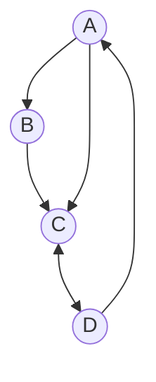
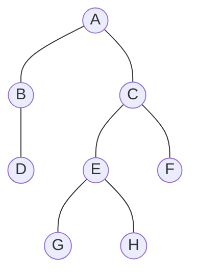

## 정렬 알고리즘

> 정렬된 N개의 데이터 처리에 대한 시간복잡도

* O(n^2): 제곱형 복잡도 (`선택정렬`, `삽입정렬`, `버블정렬`)
* O(Nlog2N): 선형 로그형 복잡도 (`합병정렬`, `퀵정렬`)
* O(1): 상수형 복잡도 (`해시 함수`)
* O(logN): 로그형 복잡도 (`이진 탐색`)
* O(N): 선형 복잡도 (`순차 탐색`)

### 선택 정렬 (오름차순)

| PASS     | 비교                                                                                          | 설명                                       | 결과              |
| :------- | :-------------------------------------------------------------------------------------------- | :----------------------------------------- | :---------------- |
| 초기자료 | 69 10 30 2 16                                                                                 |                                            | 69, 10, 30, 2, 16 |
| PASS 1   | 69 10 30 2 16              | 최소값 `2` 와 기준위치 `69` 를 교환        | 2, 10, 30, 69, 16 |
| PASS 2   | <mark>2</mark> 10 30 69 16                                  | 최소값과 기준위치가 `동일`하므로 교환 없음 | 2, 10, 30, 69, 16 |
| PASS 3   | <mark>2 10</mark> 30 69 16 | 최소값 `16` 과 기준위치 `30` 을 교환       | 2, 10, 16, 69, 30 |
| PASS 4   | <mark>2 10 16</mark> 69 30 | 최소값 `30` 과 기준위치 `69` 를 교환       | 2, 10, 16, 30, 69 |

### 삽입 정렬 (오름차순)

| PASS     | 비교                                             | 설명                                        | 결과          |
| :------- | :----------------------------------------------- | :------------------------------------------ | :------------ |
| 초기자료 | 8 3 4 9 7                                        |                                             | 8, 3, 4, 9, 7 |
| PASS 1   | 8 \| `3` 4 9 7 | 8과 `3`을 비교하여 `8 앞`으로 삽입          | 3, 8, 4, 9, 7 |
| PASS 2   | 3 8 \| `4` 9 7 | 3, 8과 `4`를 비교하여 `8 앞`으로 삽입       | 3, 4, 8, 9, 7 |
| PASS 3   | 3 4 8 \| `9` 7 | 3, 4, 8과 `9`를 비교하여 `8 뒤`으로 삽입    | 3, 4, 8, 9, 7 |
| PASS 4   | 3 4 8 9 \| `7` | 3, 4, 8, 9와 `7`를 비교하여 `8 앞`으로 삽입 | 3, 4, 7, 8, 9 |

### 버블 정렬 (오름차순)

| PASS     | 비교                                                                                                                                                                    | 설명                                                                         | 결과                                                             |
| :------- | :---------------------------------------------------------------------------------------------------------------------------------------------------------------------- | :--------------------------------------------------------------------------- |
| 초기자료 | 9 6 7 3 5                                                                                                                                                               |                                                                              | 9, 6, 7, 3, 5                                                    |
| PASS 1   | `9 6` 7 3 5 6 \| `9 7` 3 5 6 7 \| `9 3` 5 6 7 3 \| `9 5` | `9`와 `6`을 비교 `9`와 `7`을 비교 `9`와 `3`을 비교 `9`와 `5`를 비교 | 6, 9, 7, 3, 5 6, 7, 9, 3, 5 6, 7, 3, 9, 5 6, 7, 3, 5, 9 |
| PASS 2   | `6 7` 3 5 <mark>9</mark> 6 \| `7 3` 5 <mark>9</mark> 6 3 \| `7 5` <mark>9</mark>              | `6`과 `7`을 비교 `7`과 `3`을 비교 `7`과 `5`를 비교                     | 6, 7, 3, 5, 9 6, 3, 7, 5, 9 6, 3, 5, 7, 9                  |
| PASS 3   | `6 3` 5 <mark>7 9</mark> 3 \| `6 5` <mark>7 9</mark>                                                                               | `6`과 `3`을 비교 `6`과 `5`를 비교                                         | 3, 6, 5, 7, 9 3, 5, 6, 7, 9                                   |
| PASS 4   | `3 5` <mark>6 7 9</mark>                                                                                                                                                | `3`과 `5`를 비교                                                             | 3, 5, 6, 7, 9                                                    |

### 이진 탐색

> 찾는 값 `14`
>
> 초기자료 1 2 3 4 5 6 7 8 9 10 11 12 13 14 15

|  PASS  |  low  | high  | middle |
| :----: | :---: | :---: | :----: |
| PASS 1 |   1   |  15   |   8    |
| PASS 2 |   9   |  15   |   12   |
| PASS 3 |  13   |  15   |   14   |

> 데이터 목록은 반드시 사전에 오름차순으로 정렬되어 있어야 한다.
{: .prompt-tip}

---

## 소스코드 품질분석 도구

> 정적 분석 도구

* pmd
  : 코드 결함 분석

* checkstyle
  : java 코드 표준 준수 검사

* cppcheck
  : C/C++ 오버플로우 검사

* SonarQube
  : 중복코드, 복잡도, 코딩설계 등을 분석

* ccm
  : 다양한 언어의 복잡도 분석

> 동적 분석 도구

* Valance
  : 

* Avalanche
  : 프로그램의 결함 및 취약점 분석

* Valgrind
  : 프로그램 메모리 및 쓰레드 결함 분석

---

## 테스트 기법

### White Box Testing

> 화이트 박스 테스트란?

* 원시 코드의 논리적인 모든 경로를 테스트
* 설계된 절차에 초점을 둔 구조적 테스트며, 테스트 과정의 초기에 적용
* 모듈 안의 작동을 직접 관찰한다.
* 원시 코드(모듈)의 모든 문장을 한 번 이상 실행함으로써 수행된다.

> 화이트 박스 테스트의 종류

* **기초 경로 검사 (Base Path Testing)**
  * 대표적인 화이트박스 테스트 기법

* **제어 구조 검사 (Control Structure Testing)**
  * 조건 검사 (Condition Testing)
  * 루프 검사 (Loop Testing)
  * 데이터 흐름 검사 (Data Flow Testing)

### Black Box Testing

> 블랙 박스 테스트란?

* 사용자의 요구사항 명세를 보면서 테스트 하는 것이다
* 주로 구현된 기능을 테스트한다.
* 소프트웨어 인터페이스에서 실시되는 테스트
* 테스트 과정 후반부에 적용

> 블랙 박스 테스트의 종류

* **동치 분할 검사 (Equivalence Partitioning Testing)**
  * 입력 자료에 초점을 맞춰 테스트 케이스를 만들고 검사하는 방법이다. 동등 분할 기법이라고도 한다.

* **경계값 분석 (Boundary Value Analysis)**
  * 동치 분할 기법을 보완하기 위한 기법
  * 입력 조건의 중간값보다 경계값에서 오류가 발생할 확률이 높다는 점을 이용하여 입력 조건의 경계값을 테스트 케이스로 선정하여 검사하는 기법

* **원인-효과 그래프 검사 (Cause-Effect Graphing Testing)**

* **오류 예측 검사 (Error Guessing)**
  * 과거의 경험이나 확인자의 감각으로 테스트하는 기법
  * 데이터 확인 검사라고도 한다.

* **비교 검사 (Comparison Testing)**
  * 여러 버전의 프로그램에 동일한 테스트 자료를 제공하여 동일한 결과가 출력 되는지 테스트하는 기법

---

## 단위 테스트

* 구현 단계에서 각 모듈의 개발을 완료한 후 개발자가 명세서의 내용대로 정확히 구현되었는지 테스트
* 모듈 내부의 구조를 구체적으로 볼 수 있는 구조적 테스트를 주로 시행한다.
* 테스트할 모듈을 호출하는 모듈도 있고, 테스트할 모듈이 호출하는 모듈도 있다.
* Test Stub `하향식`
  * 상위 모듈을 호출했을 때 완벽한 기능을 임시로 흉내내는 가상의 하위 모듈

* Test Driver `상향식`
  * 테스트의 대상이 되는 하위 모듈을 호출했을 때 파라미터를 전달하는 가상의 상위 모듈

* Test Suites
  * 테스트 대상 컴포넌트나 모듈, 시스템에 사용되는 테스트 케이스의 집합

### 단위 테스트 도구

* CppUnit
  : C++ 프로그래밍 언어용 단위 테스트 도구

* JUnit
  : Java 프로그래밍 언어용 단위 테스트 도구

* HttpUnit
  : 웹 브라우저 없이 웹 사이트 테스트를 수행하는 데 사용되는 오픈소스 테스트 프레임워크

---

## 외계인 코드

* 아주 오래되거나 참고문서 또는 개발자가 없어 유지보수 작업이 어려운 프로그램

---

## 제어흐름 그래프

> McCabe의 cyclomatic 수를 구하는 방법

> V(G) = Edge - Node + 2\
> Edge = 6 (화살표)\
> Node = 4 (동그라미)
>
> V(G) = 6 - 4 + 2 = 4
{: .prompt-tip}

---

## EAI (Enterprise Application Intergration)

> 기업 내 각종 애플리케이션 및 플랫폼 간의 정보 전달 연계 통합 등 상호연동이 가능하게 해주는 솔루션

### EAI 구축 유형

* Point-to-Point
  : 가장 기본적인 애플리케이션 통합 방식 (1:1 연결)

* Hub & Spoke
  : 단일 접점인 허브 시스템을 통해 데이터를 전송하는 중앙 집중형 방식

* Message Bus
  : 애플리케이션 사이에 미들웨어를 두어 처리하는 방식

* Hybrid
  : Hub & Spoke 와 Message Bus 혼합 방식

---

## 반정규화

> 처리량 감소, 속도 향상을 위해 저장공간을 투자하는 것

* 집계 테이블 추가
  : sum, avg 등의 계산 미리 수행

* 중복 테이블 추가
  : 서버 분리 또는 업무 구별

* 이력 테이블 추가
  : 레코드 중복 저장

* 부분 테이블 추가
  : 접근 시도가 많은 자료만 모아두기

* 진행 테이블 추가
  : A에 접근하기 위해 다수의 테이블을 거칠 경우 간소화

> 테이블 반정규화해서 집중력이 떨어짐 ( 집중이부진 )
{: .prompt-tip}

---

## 소프트웨어 품질 측정

* 개발자 관점
  : 정확성, 신뢰성, 효율성, 무결성, 유연성, 이식성, 재사용성, 상호운용성

* 사용자 관점
  : 간결성

---

## 인터페이스 구현 검증도구

* xUnit
  : Java, C++ 등 다양한 언어를 지원하는 단위 테스트 프레임워크

* STAF
  : 서비스 호출 및 컴포넌트 재사용 등 다양한 환경을 지원하는 테스트 프레임워크

* FitNesse
  : 웹 기반 테스트케이스 설계, 실행, 결과 확인 등을 지원하는 테스트 프레임워크

* NTAF
  : FitNesse의 장점인 협업과 STAF의 장점인 재사용 및 확장성을 통합한 NHN(Naver)의 테스트 자동화 프레임워크

* Selenium
  : 다양한 브라우저 및 개발 언어를 지원하는 웹 애플리케이션 테스트 프레임워크

* watir
  : Ruby를 사용하는 애플리케이션 테스트 프레임워크

---

## 자료구조

### 자료구조의 분류

* 선형 구조
  : 배열, 연결리스트, 스택, 큐, 데크

* 비선형 구조
  : 트리, 그래프

> 배열 (Array)

* 동일한 자료형의 데이터들이 같은 크기로 나열됨
* 순서를 갖고 있는 집합
* 기억장소의 추가가 어려움
* 데이터 삭제 시 메모리 낭비 발생

> 연결리스트 (Linear List)

* 노드의 포인터를 이용해 서로 연결시킨 자료 구조
* 노드의 삽입, 삭제 작업이 용이함
* 링크가 필요하기 때문에 순차 리스트에 비해 기억 공간의 이용 효율이 좋지 않음
* 포인터를 찾아야해서 접근 속도가 느림

> 스택 (Stack)

* 리스트의 한쪽 끝으로만 삽입, 삭제 작업이 이루어지는 자료 구조
* 가장 나중에 삽입된 자료가 먼저 삭제되는 후입선출(LIFO)
  
  > 드럼통
  {: .prompt-tip}

> 큐 (Queue)

* 한쪽에서는 삽입 작업이 이루어지고 한쪽에서는 삭제 작업이 이루어지도록 구성한 자료 구조
* 가장 먼저 삽입된 자료가 먼저 삭제되는 선입선출(FIFO)
* 운영체제의 작업 스케줄링에 사용함

  > 음식점에 줄서고 있는 손님들
  {: .prompt-tip}

> 데크 (Deque)

* 삽입과 삭제가 리스트의 양쪽 끝에서 모두 발생 가능
* 스택과 큐의 장점만 따서 구성됨

> 트리 (Tree)

> 트리의 차수 (자식 노드의 개수)\
> A, C, E → 2개
>
> 단말 노드 (자식이 없는 노드)\
> D, G, H, F → 4개
{: .prompt-tip}

> 트리 순회
>
> * 전위 순회 (PreOrder) `ROOT` → `LEFT` → `RIGHT`
>   : A → B → D → C → E → G → H → F
>
> * 중위 순회 (InOrder) `LEFT` → `ROOT` → `RIGHT`
>   : D → B → A → G → E → H → C → F
>
> * 후위 순회 (PostOrder) `LEFT` → `RIGHT` → `ROOT`
>   : D → B → G → H → E → F → C → A
{: .prompt-tip}

---

## 디지털 저작권 관리 (DRM)

> 구성 요소

* 클리어링 하우스 (Clearing House)
  : 저작권에 대한 사용 권한, 라이센스 발급, 사용량에 따른 관리 등을 수행하는 곳

* 콘텐츠 제공자 (Contents Provider)
  : 콘텐츠를 제공하는 저작권자

* 패키저 (Packager)
  : 콘텐츠를 메타 데이터(데이터의 속성 정보를 설명하는 데이터)와 함께 배포 가능한 형태로 묶어 암호화하는 프로그램

* 콘텐츠 분배자 (Contents Distributor)
  : 암호화된 콘텐츠를 유통하는 곳이나 사람 - ex) 멜론

* 콘텐츠 소비자 (Customer)
  : 콘텐츠를 구매해서 사용하는 주체 - ex) 멜론 이용자

* DRM 컨트롤러 (DRM Controller)
  : 배포된 콘텐츠의 이용 권한을 통제하는 프로그램 - ex) 멜론 플레이어

* 보안 컨테이너 (Security Container)
  : 콘텐츠 원본을 안전하게 유통하기 위한 전자적 보안 장치

> 기술 요소

* 암호화, 키관리, 암호화 파일 생성, 식별 기술, 저작권 표현, 정책 관리, 크랙 방지, 인증

  > 방화벽 ❌ (문제로 많이 나옴)
  {: .prompt-tip}

---

## 알고리즘 설계 기법

* Divide and Conquer (분할 정복 알고리즘)
  : 문제를 작은 문제로 분할하여 문제를 해결하는 알고리즘

* Greedy (탐욕 알고리즘)
  : 현재 시점에서 가장 최적의 방법을 선택하는 알고리즘

* Backtracking
  : 해를 찾는 도중 해가 아니어서 막히면, 되돌아가서 다시 해를 찾아가는 기법  
  (최적화 문제와 결정 문제를 푸는 방법)

---

## 물리데이터 저장소의 파티션 설계

> 파티션 유형

* 범위 분할 (Range Partitioning)
  : 지정한 열의 값을 기준으로 분할

* 해시 분할 (Hash Partitioning)
  : 해시 함수를 적용한 결과 값에 따라 분할

* 조합 분할 (Composite Partitioning)
  : 범위 분할 후 해시 함수를 적용하여 분할

---

## 검증 검사 기법

* 알파 테스트 `인수 테스트`
  : 개발자의 장소에서 사용자가 개발자 앞에서 행하는 테스트

* 베타 테스트 `인수 테스트`
  : 선정된 최종 사용자가 여러 명의 사용자 앞에서 행하는 테스트 기법 (= 필드 테스팅)

* 동치 분할 검사
  : 입력 자료에 초점을 맞춰 케이스를 만들고 테스트

* 형상 검사
  : 구성요소, 목록, 유지보수를 위한 모든 사항이 표현되어있는가를 확인

---

## Prefix • Postfix

> <mark>A * B - C / (D + E)</mark> 각각 연산법으로 변환

* **후위표기법 (Prefix)**
  1. A * B - C / (D + E)
  2. A * B - C / <mark>+DE</mark>
  3. <mark>*AB</mark> - C / <mark>+DE</mark>
  4. <mark>*AB</mark> - <mark>/C+DE</mark>
  5. <mark>-*AB/C+DE</mark>

* **전위표기법 (Postfix)**
  1. A * B - C / (D + E)
  2. A * B - C / <mark>DE+</mark>
  4. <mark>AB*</mark> - C / <mark>DE+</mark>
  5. <mark>AB*</mark> - <mark>CDE+/</mark>
  6. <mark>AB*CDE+/-</mark>
