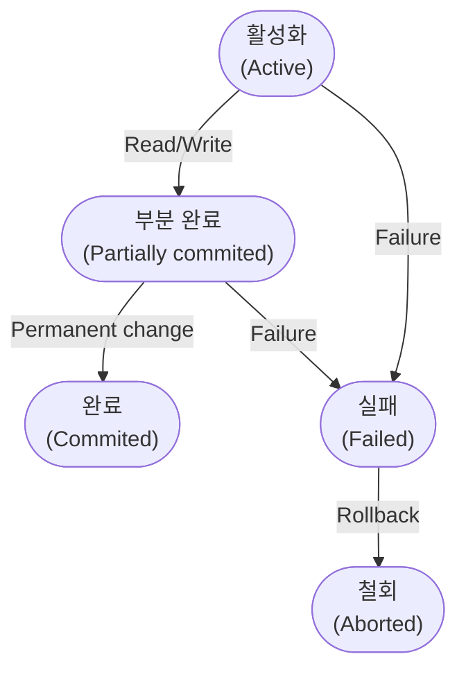

## 데이터 베이스 명령어

1. **DDL (Data Definition Languange)**

   > 데이터 정의어
   >
   > 데이터를 생성, 수정, 삭제 하는 등의 데이터 전체의 골격을 결정하는 역할을 하는 언어

   * `CREATE` 데이터베이스, 데이블 등을 생성
   * `ALTER` 테이블을 수정
   * `DROP` 데이터베이스, 테이블을 삭제
   * `TRUNCATE` 테이블을 초기화

   > SCHEMA, DOMAIN, TABLE, VIEW, INDEX 를 정의하거나 변경 또는 삭제할 때 사용
   {: .prompt-tip}

   > 데이터베이스 관리자나 설계자가 사용
   {: .prompt-tip}

2. **DML (Data Manipulation Language)**

   > 데이터 조작어
   >
   > 정의된 데이터베이스에 입력된 레코드를 조회하거나 수정하거나 삭제하는 등의 역할을 하는 언어

   * `SELECT` 데이터 조회
   * `INSERT` 데이터 삽입
   * `UPDATE` 데이터 수정
   * `DELETE` 데이터 삭제

   > 데이터베이스 사용자가 응용 프로그램이나 질의어를 통해 저장된 데이터를 실질적으로 처리하는데 사용
   {: .prompt-tip}

   > 데이터베이스 사용자와 데이터베이스 관리 시스템 간의 인터페이스를 제공
   {: .prompt-tip}

3. **DCL (Data Control Language)**

   > 데이터 제어어
   >
   > 데이터베이스에 접근하거나 객체에 권한을 주는 등의 역할을 하는 언어

   * `GRANT` 특정 데이터베이스 사용자에게 특정 작업에 대한 수행 권한을 부여
   * `REVOKE` 특정 데이터베이스 사용자에게 특정 작업에 대한 수행 권한을 박탈, 회수
   * `COMMIT` 트랜잭션의 작업을 저장
   * `ROLLBACK` 트랜잭션의 작업을 취소, 원래대로 복구

## 트랜잭션 (Transaction)

* 데이터베이스의 상태를 변화시키기 위해서 수행하는 더이상 분할이 불가능한 업무처리의 단위
* 데이터 거래에 있어서 안전성을 확보하기 위한 방법

> Git 의 Commit 과 유사
{: .prompt-tip}

### 트랜잭션의 특징

1. 원자성 (Atomicity)
   : 트랜잭션이 데이터베이스에 모두 반영되던가, 아니면 전혀 반영되지 않아야 한다.
      ```sql
      START TRANSACTION
      -- 하나의 명령어처럼 처리

      -- A의 계좌로부터 인출;
      -- B의 계좌로 입금;
      COMMIT
      ```

2. 일관성 (Consistency)
   : 트랜잭션의 작업 처리 결과가 항상 일관성이 있어야 한다.

3. 독립성 (Isolation)
   : 어떤 하나의 트랜잭션이라도, 다른 트랜잭션의 연산에 끼어들 수 없다.

4. 지속성 (Durability)
   : 트랜잭션이 성공적으로 완료됬을 경우, 결과는 영구적으로 반영되어야 한다.

### 트랜잭션의 연산

1. COMMIT
   : 트랜잭션이 성공적으로 수행되었을음 선언하고, 그 결과를 DB에 반영한다.

2. ROLLBACK
   : 트랜잭션 수행이 실패했음을 선언하고 작업을 취소하고, DB를 트랜잭션 수행 전과 일관된 상태로 되돌린다.
   
### 트랜잭션의 상태



1. 활성화 (Active)
   : 트랜잭션이 작업을 시작하여 `실행 중` 인 상태

2. 실패 (Failed)
   : 트랜잭션에 오류가 발생하여 `실행이 중단` 된 상태

3. 철회 (Aborted)
   : 트랜잭션이 비정상적으로 종료되어 `Rollback` 연산을 수행한 상태

4. 부분 완료 (Partially commited)
   : 트랜잭션의 마지막 연산까지 실행하고 `Commit` 요청이 들어온 직후의 상태  
   최종 결과를 데이터베이스에 아직 반영하지 않은 상태

5. 완료 (Commited)
   : 트랜잭션이 성공적으로 종료되어 `Commit` 연산을 실행한 후의 상태
