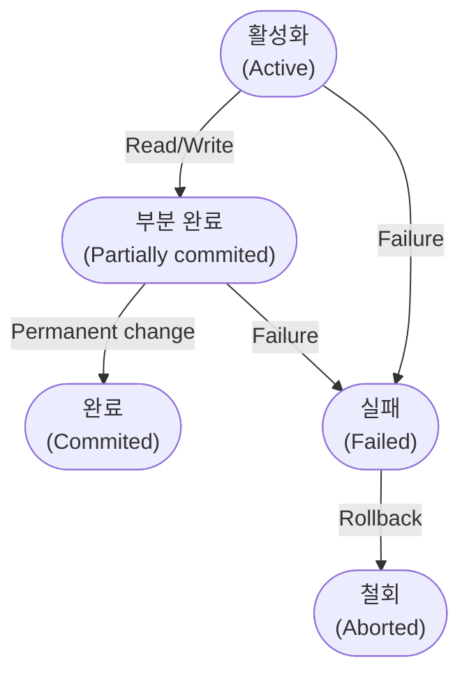

## 1. 소프트웨어 설계

### 검토 회의

* 워크 스루
   : 요구사항 명세서를 미리 배포하여 사전 검토 오류 초기 검출

* 동료 검토
   : 2-3명의 리뷰형태, 작성자가 설명하고 이해관계자들이 설명을 들음

* 인스펙션
   : 명세서 작성자를 제외한 다른 검토 전문가들이 확인하며 결함 발견

### 코드 설계

* 연상코드
   : 명칭이나 약호와 관계있는 숫자나 문자, 기호를 이용

* 블록코드
   : 공통성이 있는 것끼리 블록으로 구분

* 순차코드
   : 순차적으로 일련번호를 부여

* 표의 숫자 코드
   : 길이 넓이 부피 등 항목의 성질의 물리적인 수치를 그대로 코드에 적용

### GoF(Gang of Four)

|   유형    | 객체                                                                                                                                                                                                                                                             | 설명                                                                        |
| :-------: | :--------------------------------------------------------------------------------------------------------------------------------------------------------------------------------------------------------------------------------------------------------------- | :-------------------------------------------------------------------------- |
| 생성 패턴 | 추상 팩토리 (Abstract Factory)<br>빌더 (Builder)<br>팩토리 메서드 (Factory Method)<br>프로토타입 (Prototype)<br>싱글턴 (Singleton)                                                                                                                               | 객체 인스턴스를 생성하는 패턴                                               |
| 구조 패턴 | 어댑터 (Adapter)<br>브릿지 (Bridge)<br>컴포지트 (Composite)<br>데코레이터 (Decorator)<br>퍼싸드 (Facade)<br>플라이웨이트 (Flyweight)<br>프록시 (Proxy)                                                                                                           | 클래스와 객체를 조합해<br>더 큰 구조로 만들 수 있게 해주는 패턴             |
| 행위 패턴 | 책임 연쇄 (Chain of Responsibility)<br>커맨드 (Command)<br>인터프리터 (Interpreter)<br>반복자 (Iterator)<br>중재자 (Mediator)<br>메멘토 (Memento)<br>옵서버 (Observer)<br>상태 (State)<br>전략 (Strategy)<br>템플릿 메소드 (Template Method)<br>방문자 (Visitor) | 클래스와 객체들이 상호작용하는 방법과<br>역할을 분담하는 방법을 다루는 패턴 |

### 자료사전 표기법

| 기호 (Symbol) | 의미 (Meaning) |
| :-----------: | :------------: |
|       =       |      정의      |
|       +       |      연결      |
|      ( )      |      생략      |
|      [ ]      |      선택      |
|      { }      |      반복      |
|      **       |   설명(주석)   |

---


## 2. 소프트웨어 개발

---


## 3. 데이터베이스 구축

### 데이터 베이스 명령어

1. **DDL (Data Definition Languange)**

   > 데이터 정의어\
   > 데이터를 생성, 수정, 삭제 하는 등의 데이터 전체의 골격을 결정하는 역할을 하는 언어

   * `CREATE` 데이터베이스, 데이블 등을 생성
   * `ALTER` 테이블을 수정
   * `DROP` 데이터베이스, 테이블을 삭제
   * `TRUNCATE` 테이블을 초기화

   > SCHEMA, DOMAIN, TABLE, VIEW, INDEX 를 정의하거나 변경 또는 삭제할 때 사용
   {: .prompt-tip}

   > 데이터베이스 관리자나 설계자가 사용
   {: .prompt-tip}

2. **DML (Data Manipulation Language)**

   > 데이터 조작어\
   > 정의된 데이터베이스에 입력된 레코드를 조회하거나 수정하거나 삭제하는 등의 역할을 하는 언어

   * `SELECT` 데이터 조회
   * `INSERT` 데이터 삽입
   * `UPDATE` 데이터 수정
   * `DELETE` 데이터 삭제

   > 데이터베이스 사용자가 응용 프로그램이나 질의어를 통해 저장된 데이터를 실질적으로 처리하는데 사용
   {: .prompt-tip}

   > 데이터베이스 사용자와 데이터베이스 관리 시스템 간의 인터페이스를 제공
   {: .prompt-tip}

3. **DCL (Data Control Language)**

   > 데이터 제어어\
   > 데이터베이스에 접근하거나 객체에 권한을 주는 등의 역할을 하는 언어

   * `GRANT` 특정 데이터베이스 사용자에게 특정 작업에 대한 수행 권한을 부여
   * `REVOKE` 특정 데이터베이스 사용자에게 특정 작업에 대한 수행 권한을 박탈, 회수
   * `COMMIT` 트랜잭션의 작업을 저장
   * `ROLLBACK` 트랜잭션의 작업을 취소, 원래대로 복구

### 트랜잭션 (Transaction)

* 데이터베이스의 상태를 변화시키기 위해서 수행하는 더이상 분할이 불가능한 업무처리의 단위
* 데이터 거래에 있어서 안전성을 확보하기 위한 방법

> Git 의 Commit 과 유사
{: .prompt-tip}

#### 트랜잭션의 특징

1. 원자성 (Atomicity)
   : 트랜잭션이 데이터베이스에 모두 반영되던가, 아니면 전혀 반영되지 않아야 한다.
      ```sql
      START TRANSACTION
      -- 하나의 명령어처럼 처리

      -- A의 계좌로부터 인출;
      -- B의 계좌로 입금;
      COMMIT
      ```

2. 일관성 (Consistency)
   : 트랜잭션의 작업 처리 결과가 항상 일관성이 있어야 한다.

3. 독립성 (Isolation)
   : 어떤 하나의 트랜잭션이라도, 다른 트랜잭션의 연산에 끼어들 수 없다.

4. 지속성 (Durability)
   : 트랜잭션이 성공적으로 완료됬을 경우, 결과는 영구적으로 반영되어야 한다.

#### 트랜잭션의 연산

1. COMMIT
   : 트랜잭션이 성공적으로 수행되었을음 선언하고, 그 결과를 DB에 반영한다.

2. ROLLBACK
   : 트랜잭션 수행이 실패했음을 선언하고 작업을 취소하고, DB를 트랜잭션 수행 전과 일관된 상태로 되돌린다.
   
#### 트랜잭션의 상태



1. 활성화 (Active)
   : 트랜잭션이 작업을 시작하여 `실행 중` 인 상태

2. 실패 (Failed)
   : 트랜잭션에 오류가 발생하여 `실행이 중단` 된 상태

3. 철회 (Aborted)
   : 트랜잭션이 비정상적으로 종료되어 `Rollback` 연산을 수행한 상태

4. 부분 완료 (Partially commited)
   : 트랜잭션의 마지막 연산까지 실행하고 `Commit` 요청이 들어온 직후의 상태  
   최종 결과를 데이터베이스에 아직 반영하지 않은 상태

5. 완료 (Commited)
   : 트랜잭션이 성공적으로 종료되어 `Commit` 연산을 실행한 후의 상태

---


## 4. 프로그래밍 언어 활용

### 응집도와 결합도

* 모듈의 독립성을 판단하는 지표
* 응집도는 높을수록 좋고 결합도는 낮을수록 이상적이다.

#### 응집도 (Cohesion)

> 모듈 내부의 기능적인 응집 정도를 나타낸다.

> 밑으로 갈수록 응집도가 강함
{: .prompt-tip}

1. <span style="color: orange; font-size: 150%">우</span>연적(Coincidental Cohesion)
   : 모듈 내부의 각 구성요소들이 연관이 없을 경우

2. <span style="color: orange; font-size: 150%">논</span>리적(Logical Cohesion)
   : 실제와 달리 논리적으로만 같은 그룹으로 분류되는 처리 요소들이 한 모듈에서 처리되는 경우

3. <span style="color: orange; font-size: 150%">시</span>간적(Temporal Cohesion)
   : 연관된 기능이라기 보단 특정 시간에 처리되어야 하는 활동들을 한 모듈에서 처리할 경우

4. <span style="color: orange; font-size: 150%">절</span>차적(Procedural Cohesion)
   : 모듈 안의 구성요소들이 서로 다른 기능을 하지만 그 기능을 순차적으로 수행할 경우

5. <span style="color: orange; font-size: 150%">교</span>환적(Communicational Cohesion)
   : 서로 다른 기능을 수행하지만 동일한 입력과 출력을 사용하는 활동들이 모여있을 경우

6. <span style="color: orange; font-size: 150%">순</span>차적(Sequential Cohesion)
   : 모듈 내의 한 활동으로부터 나온 출력값을 모듈 내의 다른 활동이 사용할 경우

7. <span style="color: orange; font-size: 150%">기</span>능적(Functional Cohesion)
   : 모듈 내부의 모든 기능이 단일한 목적을 위해 수행되는 경우


#### 결합도 (Coupling)

> 모듈과 모듈간의 상호 결합 정도를 나타낸다.

> 밑으로 갈수록 결합도가 약함
{: .prompt-tip}

1. <span style="color: orange; font-size: 150%;">내</span>용 결합도(Content Coupling)
   : 다른 모듈 내부에 있는 변수나 기능을 다른 모듈에서 사용 하는 경우

2. <span style="color: orange; font-size: 150%;">공</span>통 결합도(Common Coupling)
   : 파라미터가 아닌 모듈 밖에 선언되어 있는 전역 변수를 참조하고 전역변수를 갱신하는 식으로 상호작용하는 경우

3. 외<span style="color: orange; font-size: 150%;">부</span> 결합도(External Coupling)
   : 어떤 모듈에서 반환한 값을 다른 모듈에서 참조해서 사용하는 경우

4. <span style="color: orange; font-size: 150%;">제</span>어 결합도(Control Coupling)
   : 어떤 모듈이 다른 모듈의 내부 논리 조직을 제어하기 위한 목적으로 제어신호를 이용하여 통신하는 경우

5. <span style="color: orange; font-size: 150%;">스</span>탬프 결합도(Stamp Coupling)
   : 모듈간의 인터페이스로 배열이나 오브젝트, 스트럭쳐등이 전달되는 경우

6. <span style="color: orange; font-size: 150%;">자</span>료 결합도(Data Coupling)
   : 모듈간의 인터페이스 전달되는 파라미터를 통해서만 모듈간의 상호 작용이 일어나는 경우

---


## 5. 정보시스템 구축관리

### 정보보안 3요소

1. **기밀성 (Confidentiality)** `열람`
   * 승인되지 않은 사람이 정보를 열람할 수 없게 한다.

   > 문서 암호화, 문서 중앙화
   {: .prompt-tip}

2. **무결성 (Integrity)** `수정`
   * 승인되지 않은 사람이 정보를 수정할 수 없게 한다.

   > 위변조 방지, 방화벽
   {: .prompt-tip}

3. **가용성 (Availability)** `삭제`
   * 승인된 사람이 정보가 필요할 때 사용할 수 있게 한다.
   * 승인되지 않은 사람이 정보를 삭제할 수 없게 한다.

   > 백업, 클라우드 동기화
   {: .prompt-tip}
