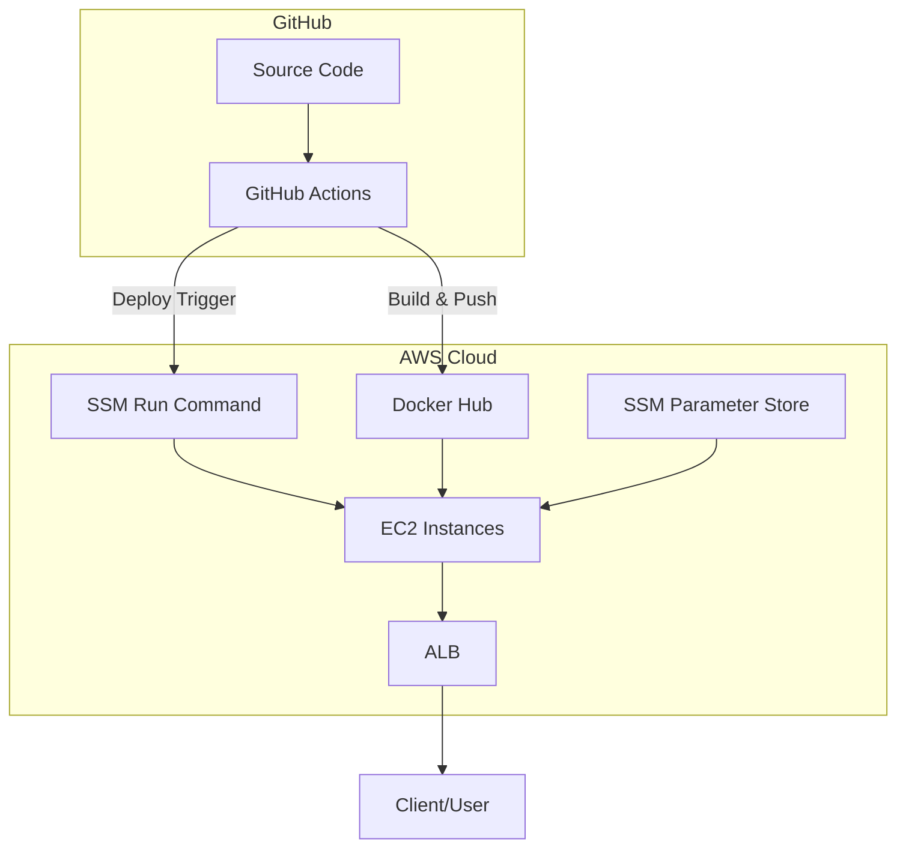

> 프로젝트 개발 과정에서 AWS의 여러 서비스를 적용해보면서, \
> 단순한 배포를 넘어 CI/CD 파이프라인까지 직접 구축하게 되었습니다. \
> 이번 포스팅의 시리즈에서는 제가 경험한 과정을 기록하고, 배운 점들을 정리해보려고 합니다.

해당 프로젝트의 전체소스는 [여기](https://github.com/younghunkimm/sparta-spring-plus){:target="_blank"} 에서 확인하실 수 있습니다.

## 1. CI/CD 도입 배경
---

과거에는 **jar 파일을 직접 서버에 올리고 실행**하는 방식으로 배포를 진행했습니다.  
이 방식에는 몇 가지 한계가 있었습니다:

- 서버에 직접 접속해야 하는 불편함
- 테스트를 건너뛰거나 환경 변수를 잘못 주입하는 **실수 위험**
- 배포 과정이 자동화되지 않아 **반복 가능성과 안정성 부족**
- 서버 환경이 달라질 때마다 동일한 실행 환경을 보장하기 어려움

이런 문제를 해결하기 위해, **Docker**를 도입한 **CI/CD 파이프라인**을 구축하기로 했습니다.

 
 
 

## 2. 최종 목표
---

CI/CD 파이프라인의 목표는 다음과 같습니다.

- **자동화된 빌드 & 배포**: main 브랜치에 push되면 자동으로 빌드 후 배포  
- **환경변수 안전 관리**: AWS SSM Parameter Store를 활용  
- **안정적 운영**: 배포 실패 시 빠르게 원인 파악 및 복구 가능  
- **무중단 서비스 지향**: ALB 기반 트래픽 분산 구조  

 
 
 

## 3. 전체 아키텍처 다이어그램
---

### 다이어그램

아래 다이어그램은 이번 프로젝트에서 구축한 전체 아키텍처입니다.  

### 각 구성 요소의 역할

- **EC2**  
  애플리케이션이 구동되는 서버 인스턴스  
  Docker 컨테이너 환경에서 Spring Boot 애플리케이션을 실행  

- **ALB (Application Load Balancer)**  
  여러 EC2 인스턴스에 트래픽을 분산  
  헬스 체크를 통해 비정상 인스턴스를 자동으로 제외  

- **Docker Hub**  
  빌드된 이미지를 저장하는 **Private Repository**  
  GitHub Actions에서 빌드 후 푸시  

- **GitHub Actions**  
  CI/CD 자동화를 담당하는 핵심  
  - CI: 빌드 & 테스트 검증  
  - CD: Docker Hub → EC2 배포 자동화  

- **SSM Parameter Store**  
  DB 접속 정보, JWT 시크릿 키 등 환경변수를 안전하게 저장 및 관리  

- **SSM Run Command**  
  EC2 인스턴스에 원격으로 배포 스크립트를 실행하는 역할  

 
 
 

## 다음 포스팅
---

이번 포스팅에서는 **전체 아키텍처** 과정을 정리했습니다.  
다음 포스팅에서는 **AWS 인프라 세팅** 과정을 다룹니다.
