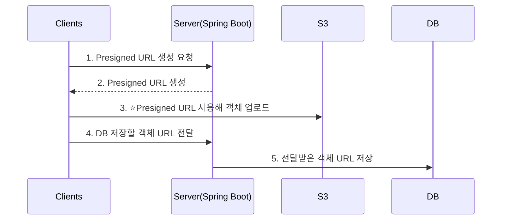

해당 프로젝트의 전체소스는 [여기](https://github.com/younghunkimm/sparta-spring-plus){:target="_blank"} 에서 확인하실 수 있습니다.

> 해당 포스팅에서는 유저 프로필 이미지 업로드/다운로드를 예시로 진행합니다.
{: .prompt-tip}

## Presigned URL이란?
---



### 정의

`Presigned URL`은 **S3 객체에 접근할 수 있는 임시 URL**입니다.  
기존에는 서버가 클라이언트의 파일을 받아 S3에 업로드했지만,  
`Presigned URL`을 사용하면 클라이언트가 직접 S3에 파일을 업로드할 수 있습니다.

### Presigned URL이 필요한 이유

일반적으로 클라이언트가 서버를 거쳐 S3에 파일을 업로드하면, 서버 리소스가 낭비됩니다.

- **문제점**
  - 서버가 파일을 받아 다시 S3로 업로드
  - 대용량 파일 업로드 시 서버 부하 증가

- **해결 방법**
  - 서버는 단순히 Presigned URL만 발급
  - 클라이언트가 URL을 통해 직접 S3에 업로드

즉, 서버는 **권한 위임자**, 클라이언트는 **직접 업로더** 역할을 합니다.

### Presigned URL의 장점

- **서버 부하 감소**: 대용량 파일도 서버를 거치지 않고 바로 S3에 업로드 가능
- **보안 강화**: 짧은 만료 시간, 특정 파일에만 접근 가능
- **성능 향상**: 클라이언트가 직접 S3에 업로드하기 때문에 네트워크 홉(hop) 감소
- **비용 절감**: 서버 리소스 사용량 감소로 운영 비용 절감
- **사용자 경험**: 빠른 업로드 속도와 안정적인 전송, 업로드 진행률 표시로 체감 만족도 향상

<br><br><br>

## AWS 설정
---

### 1. S3 Bucket 생성

{:style="border-radius: 1rem"}

#### ACL 설정

> ACL를 활성화한다면?

업로드 시점에 객체별로 세부 권한을 지정할 수 있습니다.

```java
PutObjectRequest request = new PutObjectRequest(bucket, key, file)
        .withCannedAcl(CannedAccessControlList.PublicRead);
s3Client.putObject(request);
```

- `PublicRead`: 모든 사용자에게 읽기 권한 부여
- `Private`: 소유자만 읽기/쓰기 권한
- `BucketOwnerFullControl`: 업로드한 객체의 권한을 버킷 소유자와 공유

> ACL를 비활성화한다면?

- 모든 객체는 기본적으로 `Private`
- 대신 `Bucket Policy`, `IAM Policy`, `S3 Presigned URL` 등을 통해서 권한을 제어

<span style="color: orange">즉, Presigned URL을 사용하기 때문에 ACL를 비활성화 해줍니다.</span>

나머지 옵션은 기본값으로 두고, 버킷을 생성합니다.

<br>

#### Public Access 설정

Public Access 차단 설정을 모두 활성화합니다.

{:style="border-radius: 1rem"}

<br>

### 2. Bucket Policy 설정

Bucket은 기본적으로 2중 보안이 되어 있습니다.

{:style="border-radius: 1rem"}

위에서 이미 Public Access 설정을 모두 활성화했기 때문에 넘어가고,  
버킷 정책에 편집 버튼을 눌러 정책을 수정합니다.

<br>

정책 생성기를 클릭하고,

{:style="border-radius: 1rem"}

<br>

아래의 정책들을 검색하여 추가해줍니다.

- `PutObject`: 객체 업로드 권한
- `GetObject`: 객체 다운로드 권한
- `DeleteObject`: 객체 삭제 권한

{:style="border-radius: 1rem"}

버킷 안의 모든 객체에 대해 위의 권한을 허용하기 위해  
`arn:aws:s3:::<YOUR_BUCKET_NAME>/*` 으로 리소스를 지정합니다.

<br>

`Generate Policy` 버튼을 클릭하고, 생성된 정책을 복사합니다.

{:style="border-radius: 1rem"}
{:style="border-radius: 1rem"}

<br>

복사한 JSON을 붙여넣고 저장합니다.

{:style="border-radius: 1rem"}

<br>

### 3. IAM 사용자 생성

IAM 사용자를 생성하고, 이 사용자에게 S3 Bucket에 대한 액세스 권한을 부여할 수 있습니다.

{:style="border-radius: 1rem"}
{:style="border-radius: 1rem"}

최소 권한 원칙에 따라 필요한 권한만 부여하는게 맞지만,  
지금은 편의를 위해 `AmazonS3FullAccess` 정책을 연결합니다.

{:style="border-radius: 1rem"}

**최소 권한 예시**
```json
{
  "Version": "2012-10-17",
  "Statement": [
    {
      "Sid": "ListOnlyLocalProfile",
      "Effect": "Allow",
      "Action": "s3:ListBucket",
      "Resource": "arn:aws:s3:::<YOUR_BUCKET_NAME>",
      "Condition": {
        "StringLike": {
          "s3:prefix": ["local/profile/*"]
        }
      }
    },
    {
      "Sid": "RWLocalProfile",
      "Effect": "Allow",
      "Action": ["s3:GetObject","s3:PutObject","s3:DeleteObject","s3:AbortMultipartUpload"],
      "Resource": "arn:aws:s3:::<YOUR_BUCKET_NAME>/local/profile/*"
    }
  ]
}
```

검토 후 사용자를 생성합니다.

<br>

### 4. 액세스 키 발급

생성한 `IAM` 사용자 계정에 기반한 액세스 키를 발급받아  
`Spring Boot Application`에서 `S3`에 대한 접근권한을 얻습니다.  

상세 페이지로 들어가 `보안 자격 증명` 탭에서 `액세스 키 만들기` 버튼을 클릭합니다.

{:style="border-radius: 1rem"}

<br>

보기 중 하나를 선택합니다. (기능 차이는 없습니다)

{:style="border-radius: 1rem"}

<br>

설명 입력 후 `액세스 키 만들기` 버튼을 클릭합니다.

{:style="border-radius: 1rem"}

<br>

액세스 키를 발급 받은 직후에만 액세스 키와 비밀 액세스 키를 확인할 수 있으니 꼭 따로 메모를 해두어야 합니다.

{:style="border-radius: 1rem"}

> 해당 키들은 로컬 개발 환경에서 환경 변수로 등록하여 자격증명을 얻습니다.  
> 즉, 로컬 개발용으로 사용할 키를 발급 받는 과정입니다.
{: .prompt-info}

<br>

### 5. EC2 Instance Profile 인라인 정책 생성

`EC2 Instance`에 연결되어 있는 `IAM Role`의 상세페이지로 들어가 인라인 정책을 생성합니다.

{:style="border-radius: 1rem"}

<br>

- 객체 조회 및 업로드 권한 허용 (운영용 폴더 `prod/profile/*` 경로 제한)
- `Resource` 경로는 `S3 Bucket`의 ARN 복사 후 허용할 경로를 지정해줍니다.

```yaml
{
    "Version": "2012-10-17",
    "Statement": [
        {
            "Sid": "AllowProfileObjectRW",
            "Effect": "Allow",
            "Action": [
                "s3:GetObject",
                "s3:PutObject",
                "s3:DeleteObject"
            ],
            "Resource": [
                "arn:aws:s3:::<YOUR_BUCKET_NAME>/prod/profile/*"
            ]
        }
    ]
}
```

- 만약 다른 도메인의 객체도 접근해야 한다면, `Resource` 아래에 해당 도메인 경로 추가
  ```yaml
  "arn:aws:s3:::<YOUR_BUCKET_NAME>/prod/post/*" # 게시글 예시
  ```

> 운영 환경에서는 해당 `EC2 Instance Profile`을 통해 자격증명을 얻습니다.
{: .prompt-info}

<br>

### 운영서버와 로컬서버 자격증명 차이 설명

`AWS SDK for Java v2`에서는 자격증명을 찾기 위해 `DefaultCredentialsProvider` 를 사용하며,  
`Spring Boot Application`에서는 관련 의존성 추가 시 기본적으로 이 프로바이더를 사용합니다.  
해당 프로바이더는 다음과 같이 체인 방식으로 접근을 하게 됩니다. ([공식문서 참고](https://docs.aws.amazon.com/sdk-for-java/latest/developer-guide/credentials.html){:target="_blank"})  

1. 환경 변수
   - `AWS_ACCESS_KEY_ID` 및 `AWS_SECRET_ACCESS_KEY`

2. Java 시스템 속성
   - `aws.accessKeyId` 및 `aws.secretKey`

3. Web Identity Token (OIDC, EKS 등)
   - `AWS_WEB_IDENTITY_TOKEN_FILE` 및 `AWS_ROLE_ARN`

4. Shared Credentials 파일 (`~/.aws/credentials`)
   - `AWS_PROFILE` 지정 가능, 기본값은 `default` 프로파일

5. AWS Config 파일 (`~/.aws/config`)
   - `region` 및 `profile` 지정 가능

6. EC2/ECS 메타데이터 서비스 (`IMDS` / `ECS Task Role`)
   - `EC2 Instance`에 `IAM Role`이 연결된 경우, 해당 `Role`의 권한을 사용
   - `EC2/Fargate`라면 Task Role 획득

#### 운영서버

`EC2 Instance Profile` 정책에 S3 권한 정책을 설정해주면,  
`EC2 Instance`에서 `IMDS`를 통해 역할(Role) 정보를 받아 S3에 접근할 수 있습니다.   

즉, `EC2 Instance`에서 `S3 Bucket`에 접근할 때는 별도의 `Access Key` 및 `Secret Key` 없이도   
역할(Role) 기반으로 권한이 부여되기 때문에 환경변수로 관리할 필요가 없어 보안에 유리합니다.  

<span style="color: orange;">6번 체인에서 **IMDS**를 통해 자격증명을 찾습니다.</span>

#### 로컬서버

로컬 개발 환경에서는 `EC2 Role`이 적용되지 않기 때문에,  
`.env.local` 파일에 S3 `Access Key`와 `Secret Key`를 환경변수로 설정하여 S3에 접근합니다.   

`Access Key`와 `Secret Key`는 S3 버킷 정책에서 `local` 폴더에 대한 접근 권한이 있는 `IAM User`로 발급받아야 합니다.  

<span style="color: orange;">1번 체인에서 **환경 변수**를 통해 자격증명을 찾습니다.</span>

##### local env example

```html
AWS_ACCESS_KEY_ID=<Access Key>
AWS_SECRET_ACCESS_KEY=<Secret Key>
```

<br><br><br>

## 다음 포스팅
---

이번 포스팅에서는 **정의와 AWS 설정** 과정을 정리했습니다.  
다음 포스팅에서는 **Spring Boot Presigned URL 설정** 과정을 다룹니다.
