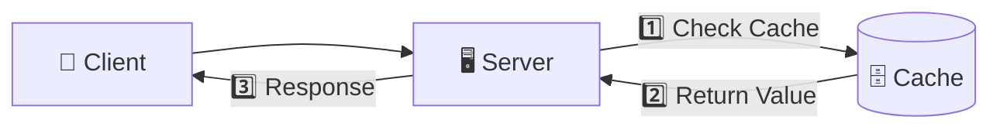
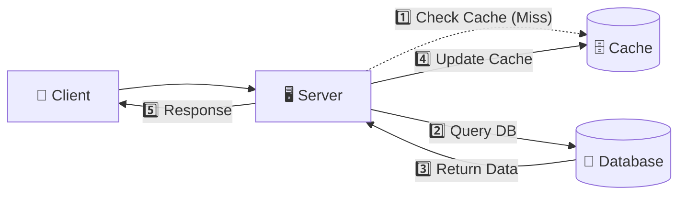
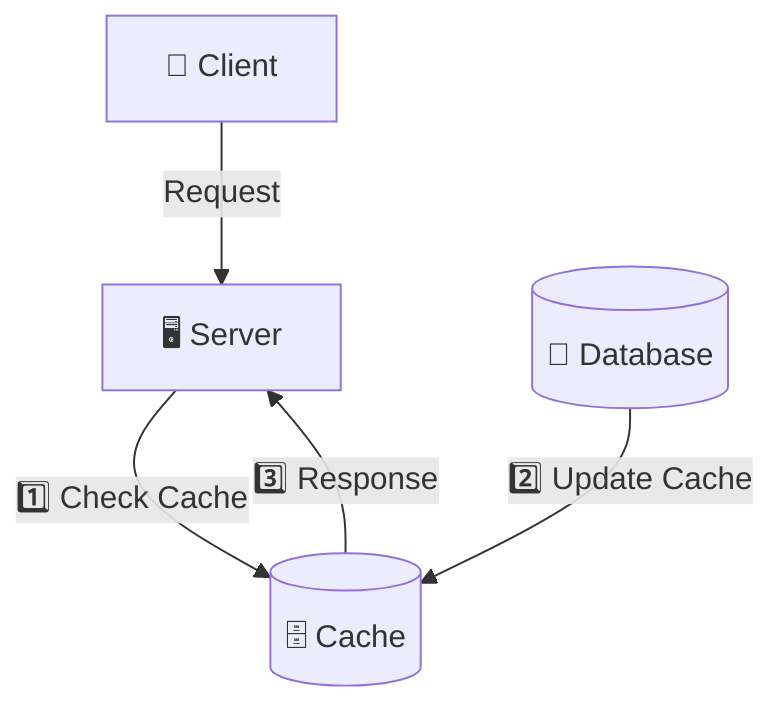
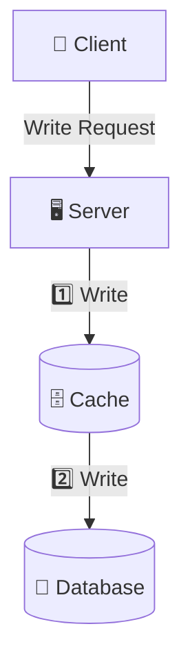
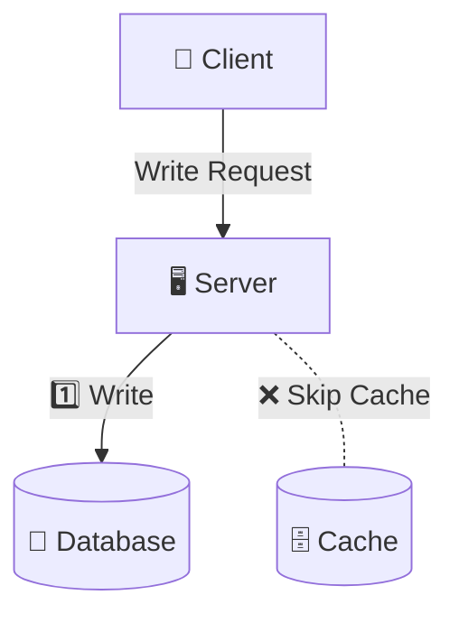
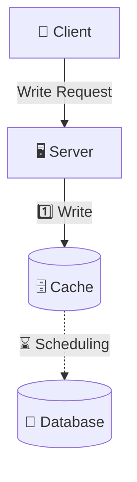

## 캐시 (Cache)
---

캐시는 자주 접근하는 데이터를 미리 저장해 두어 데이터 조회 속도를 높이는 역할을 한다.  
매 요청마다 원본 데이터베이스에 접근하는 대신 캐시에서 데이터를 읽어 응답 시간을 단축하고 데이터베이스 부하를 줄인다.  

파레토 법칙에 따라 전체 요청의 80%가 자주 조회되는 20%의 데이터에 집중되는 경우가 많아,  
캐시를 효과적으로 활용하면 시스템 성능을 크게 향상시킬 수 있다.

{: style="filter: invert(100%);" }

  

## 캐싱 전략 (Caching Strategy)
---

캐시를 사용하게 되면 데이터 정합성, 장애 허용성, 운영 복잡도 측면에서 여러 가지 고려사항이 생긴다.  

그 중 캐싱된 데이터와 원본 데이터 간의 일관성을 어떻게 유지할지에 대한  
데이터 정합성을 유지하기 위해 현재 상황에 맞는 적절한 캐싱 전략을 선택하는 것이 중요하다.  

대표적인 캐싱 전략으로는 5가지가 있고, 보통 현재 상황에 맞게 읽기 전략과 쓰기 전략을 조합하여 사용한다.

  

## 읽기 전략
---

### 1. Cache-aside

> Look-aside 패턴이라고도 불린다.

<strong>Cache Hit</strong>

 

<strong>Cache Miss</strong>

애플리케이션에서 캐싱을 할 때 가장 많이 쓰이는 전략 패턴이다.  

애플리케이션이 캐시를 먼저 조회하고, 미스가 나면 DB에서 데이터를 읽은 뒤 캐시에 적재한다.  
쓰기는 DB에 반영한 후 캐시를 업데이트하거나 무효화한다.

- **장점**
  - 캐시 장애 시에도 DB만으로 서비스가 지속 가능하여 회복력이 높다.
  - 필요한 데이터만 캐시에 올라오므로 메모리 사용이 효율적이다.
  - 읽기 패턴이 집중되는 정원 조회에 최적화되어 Redis 히트율을 높일 수 있다.
- **단점**
  - 첫 접근 시 DB를 거쳐야 하므로 초기 응답 지연이 존재한다.
    - 이를 완화하기 위해 배치 작업이나 미리 캐시를 채우는 방식(`warm-up`)을 병행할 수 있다.
  - 쓰기 후 캐시 무효화 타이밍이 어긋나면 짧은 시간 동안 정합성 문제가 생길 수 있다.

 

### 2. Read-through

Cache-aside와 유사하지만, 캐시 미스 시 애플리케이션이 아닌 캐시에서 직접 DB에서 데이터를 로드해 캐시에 채운다.  
즉, 애플리케이션은 캐시만 바라보고, 캐시가 DB와의 상호작용을 담당한다.

- **장점**
  - 미스 처리 로직이 캐시 쪽으로 숨겨져 애플리케이션 코드가 단순해진다.
  - 동일 키에 대한 동시 미스가 발생해도 캐시 제공자가 내부적으로 단일 로드를 보장할 수 있다.
- **단점**
  - 캐시 서버에 장애가 발생하면 DB 접근이 불가능해져 서비스 장애로 이어질 수 있다.
    - Replication 또는 Cluster 구성을 통해 캐시 장애에 대비해야 한다.

  

## 쓰기 전략

### 1. Write-through
---

데이터 쓰기 시 애플리케이션이 캐시에 먼저 반영하고,  
캐시에서 동기적으로 DB에도 반영한다.

- **장점**
  - DB와 캐시가 항상 동일 상태라 읽기 직후 정합성이 높다.
  - 캐시 미스를 최소화할 수 있다.
- **단점**
  - 쓰기 경로가 캐시 의존적이어서 Redis 장애가 곧바로 서비스 실패로 이어질 수 있다.
  - 저장할 때 캐시와 DB를 모두 갱신하므로 쓰기 지연이 커질 수 있다.
  - 자주 사용하지 않는 데이터가 캐시에 남아 메모리 낭비가 발생할 수 있다.
    - 이를 완화하기 위해 TTL(만료시간)을 꼭 사용해야 한다.

  

### 2. Write-around
---

쓰기를 DB에만 반영하고 캐시는 건너뛰며, 이후 읽기에서 캐시 미스가 발생하면 cache-aside처럼 로드한다.

- **장점**
  - 쓰기 경로가 단순하고 Redis 의존도가 낮다.
  - 일회성으로만 읽히는 데이터의 캐시 오염을 줄일 수 있다.
- **단점**
  - 갱신 직후 읽기 요청이 많으면 캐시 미스가 폭증해 DB 부하가 급증한다.
  - 최신 데이터가 캐시에 늦게 반영되어 일시적 정합성 저하가 발생한다.

### 3. Write-behind
---

> Write-back 패턴이라고도 불린다.

쓰기를 캐시에 먼저 반영하고 비동기적으로 DB에 반영한다. 캐시가 사실상 `Source of Truth`를 겸하게 된다.

- **장점**
  - 쓰기 요청을 빠르게 처리할 수 있어 레이턴시가 낮다.
  - 다수의 쓰기를 배치로 DB에 반영해 효율을 높일 수 있다.
- **단점**
  - 캐시 장애 시 아직 DB에 반영되지 않은 데이터가 유실될 위험이 있다.
  - 캐시와 DB 간 정합성을 보장하려면 복잡한 동기화·장애 복구 설계가 필요하다.
